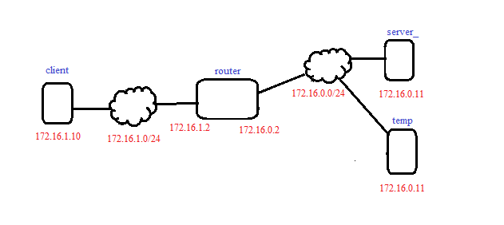

# Intelligent-forensics-for-the-automatic-anomaly-detection-in-distributed-infrastructures

The system is composed by a client (ubuntu 22.04 with iputils-ping and iproute2), 2 server (server_: ubuntu 22.04; temp: ubuntu 22.04 with iputils-ping, iproute2, nodejs, npm and other packet that still have their usefullness to be checked) and a router (ubuntu 22.04 with iputils-ping, iproute2, coreutils, iptables, frr).
Right now frr is still not doing is job but it seems to be active.

To run the system:
1. run the docker engine (tested: by running docker desktop)
2. launch the command "docker-compose up -d"
3. access the server temp "docker exec -it intelligent-forensics-temp-1 bash". Add the route to the client network "ip route add 172.16.1.0/24 via 172.16.0.2", in which 172.16.0.2 is the interface of the router connected to the server.
4. in another terminal, access the client "docker exec -it intelligent-forensics-client-1 bash". Add the route to the server network "ip route add 172.16.0.0/24 via 172.16.1.2", in which 172.16.1.2 is the interface of the router connected to the client. Test the connection "ping 172.16.0.11" by pinging the server temp.
5. access the router "docker exec -it intelligent-forensics-router-1 bash". Start frr "service frr start" and check its status "service frr status" is:
 * Status of watchfrr: running
 * Status of zebra: running
 * Status of bgpd: running
 * Status of ospfd: running
 * Status of staticd: running
which means all the frr daemons chosen are running.

# advices
If the images gets modified by changing the dockerfiles, to be effective the image should be mounted again or simply deleted before using again "docker-compose up -d". Fast way is deleting the images.