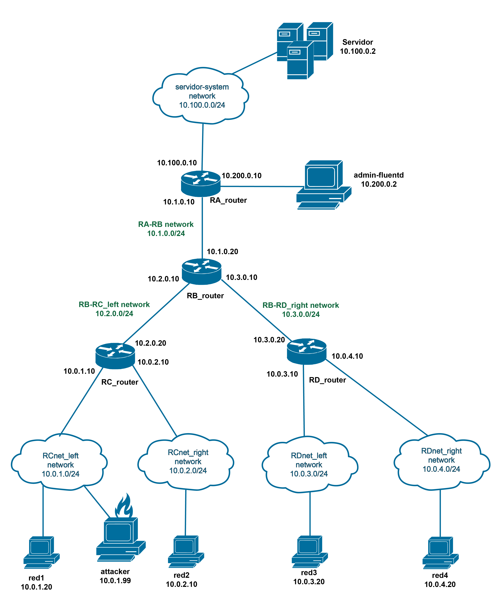

# Intelligent-forensics-for-the-automatic-anomaly-detection-in-distributed-infrastructures



# NEW VERSION

## Start the network

To start the network run
```
docker-compose up -d
```
in newenvironment folder
## Start the experiment

To start the experiment enter the servidor container
```
docker exec -it newenvironment_servidor_1 /bin/bash
```
and run
```
python3 /servidor/output/DoSdetector/1clock.py
```

## Attack

To start the attack, enter the attacker:
```
docker exec -it newenvironment_attacker_1 /bin/bash
```
##### To perfrom slowhttp attack:
```
slowhttptest -H -g -c 5260 -i 10 -r 30 -t GET -u http://10.100.0.2:3000/ -x 24 -p 3
```
##### To perform SYN flood attack:
```
python3 HULK-v3/hulk_launcher.py server -p 3000 http://100.10.0.2:3000
```
enter another terminal with:
```
docker exec -it newenvironment_attacker_1 /bin/bash
```
and finally run:

```
python3 HULK-v3/hulk_launcher.py client -n 10
```

## Results

To see the predictions enter the professor-fluentd container:
```
docker exec -it newenvironment_professor-fluentd_1 /bin/bash
```
enter the folder output to see the logs or the folder shared-volume/prediction to see the live result in the file temp.txt.
Otherwise, it is possible to analyse a time interval of a specific log file present in output/dos with:
```
python3 /shared-volume/prediction/intervalModelUser.py /output/DoS/[nameofthelog.log]
```
e.g.
```
python3 /shared-volume/prediction/intervalModelUser.py /output/DoS/dos.log.20240521.logù
```
Finally the program will ask to insert a time interval to analyse.
It is also possible to predict a single line of log by running manualModelUser.py.


## Final consideration
Right now the syn flood attack completely blocks the correct functioning of the 1clock.py script.
The slowhttp attack get recognised.


# advices
If the images gets modified by changing the dockerfiles, to be effective the image should be mounted again or simply deleted before using again "docker-compose up -d". Fast way is deleting the images.