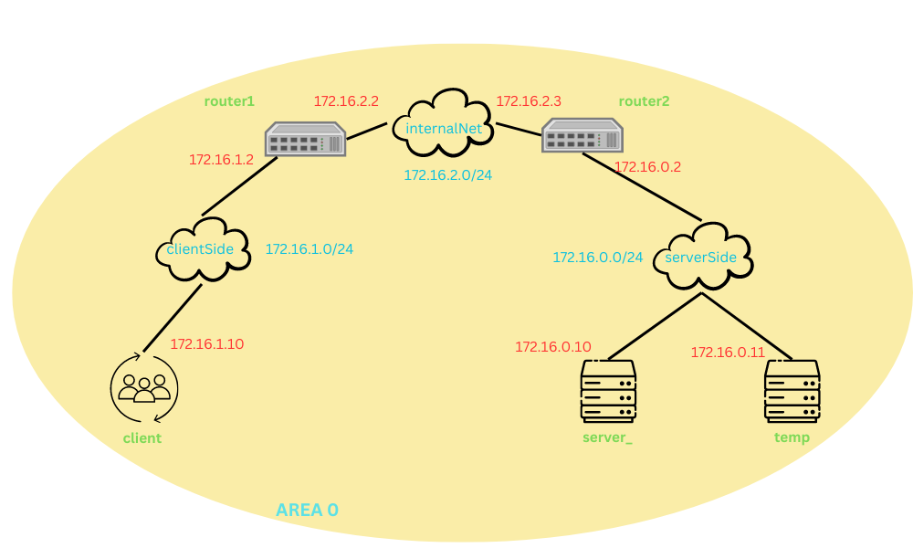

#DOCKER FILE EXPLAINED
Since we are performing privileged operation the USER is set to root
##Packages
iproute2 -> for the command ip route
coreutils -> for the shell scripting and basic operationlike cat, grep, ls, cp
iptables -> to retrieve the iptables

frr -> software
syslog-ng -> to collect logs relative to the system

##Configuration section
The command sed (stream editor) allows text manipulation. The "-i" addition, performs in place editing, allowing the substitution of the line with the correct one.
The file etc/frr/daemons (responsible of the frr daemons) and the file etc/services (takes notes of the service-port association) are modified, activating the daemons ospf, zebra and other (not necessary for the moment).
The file etc/sysctl.conf is modified to let the router forward the packets.
Finally the syslog-ng is set to directly send the syslog to the fluentd container (addr: 172.16.10.2 : 5140).

##Entrypoints for router
The entrypoint scripts are copied, which means they are integrated in the image of the router. To change them, the image needs to be changed as well. Since this image is common for all the router, all the entrypoint scripts have to be copied.
Finally they are made executable thanks to chmod.

###Entrypoints script
The scripts are in the folder ./entrypoints.
* Services syslog-ng and frr are started. From this moment the systems collect the logs relative to the system and start the daemons of frRouting
* The second part is relative to the configuration of frr. This happens by means of the vty shell. The log file is set to be frr*.log (where * corresponds to the ID of the router). Then, the router ospf is set, with the respective network the router communicates with.

* Finally a command sleep is called so that the container doesn't terminate its activity.